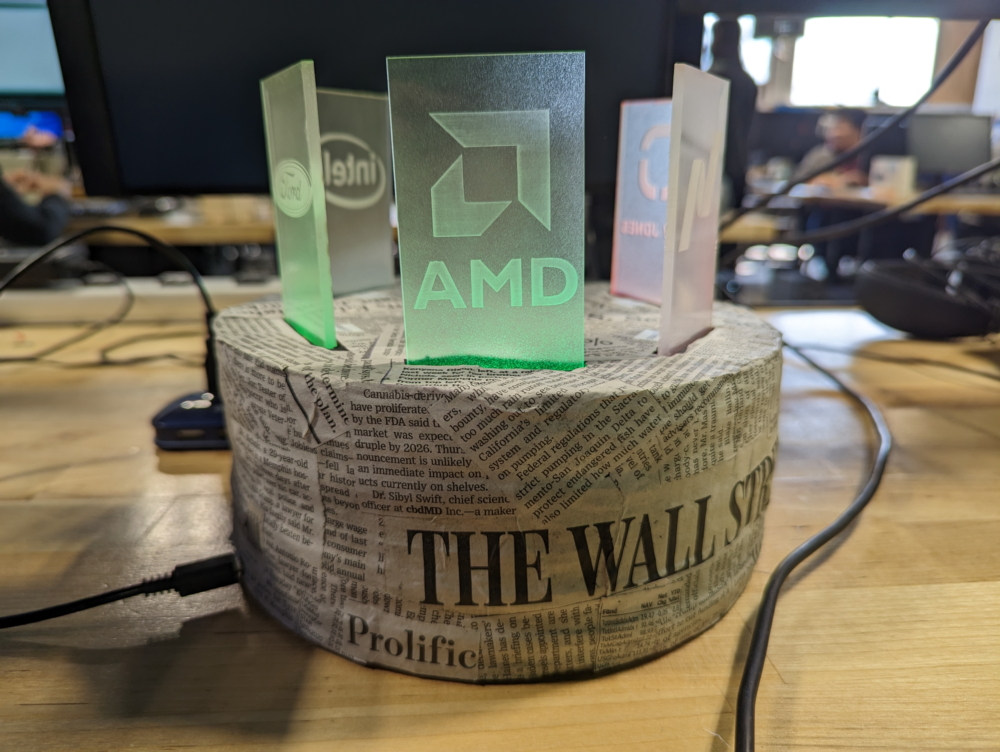

# lightbox

# ABANDONED PROJECT
his was a project for school and the code will no longer be maintained. It will most likely continue to work, but there are no guarantees.

# StockBox

These are all the files relating to my [lightbox project](https://scott.nopreserveroot.xyz/tags/lightbox/). This takes data from the yahoo finance API and displays the data through the color that different acrylic panels are illuminated in.

This all runs on a Raspberry Pi Pico using MicroPython.

On the final project I decoupaged newspaper onto the body, but it is not necessary if you are going to make it yourself.

